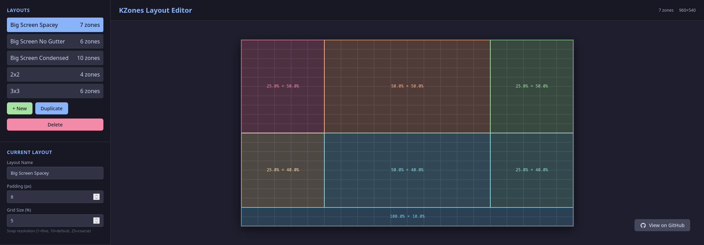

# KZones Layout Editor

A visual editor for creating and managing KZones window layouts.

**[Launch Web App](https://rdbell.github.io/kzones-editor/)**

## Usage

1. Draw zones by clicking and dragging on the canvas
2. Click zones to select and edit them
3. Drag zone edges or corners to resize
4. Create multiple layouts using the sidebar
5. Export your layouts as JSON when finished

## Features

- **Visual Zone Creation**: Draw zones with your mouse
- **Grid Snapping**: Automatic alignment for clean layouts
- **Multiple Layouts**: Create and switch between different configurations
- **Zone Editing**: Resize, move, and duplicate zones
- **Application Assignment**: Assign specific apps to zones
- **Import/Export**: Save and share your layouts

## Tips

- Adjust the grid size for finer or coarser control (1% = fine, 25% = coarse)
- Use the duplicate button to quickly create similar zones
- Drag layouts in the sidebar to reorder them
- Your layouts are automatically saved in your browser

## Export

Click the "Export" button to copy your layout JSON. Use this JSON file with KZones to apply your custom window layouts.
